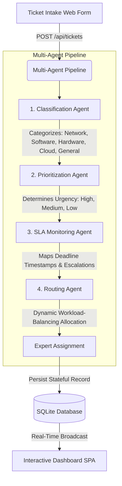

# 🤖 IT Support Flow: Intelligent Ticket Routing Agent

<p align="center">
  
  
  
  
  
  
</p>

---

**IT Support Flow** is a production-grade, stateful, GenAI-powered IT support ticket intake and routing service. It leverages a sequential multi-agent pipeline to automatically classify ticket categories, determine urgency priorities, compute SLA deadlines, and dynamically route tasks to qualified enterprise support experts using real-time workload load-balancing.

The application features a modular FastAPI backend, SQLAlchemy ORM database persistence, Hugging Face Inference API integrations (with zero-configuration local fallbacks), secure JWT-based Role-Based Access Control (RBAC), and a premium glassmorphic Single-Page Application (SPA) dashboard.

---

## 🏛️ System Architecture & Agent Flow

The system employs a sequential multi-agent design represented by the following flow:



1. **Classification Agent:** Analyzes the issue summary and description using the Hugging Face zero-shot text classification API (`facebook/bart-large-mnli`). It determines the best fit category among `Network`, `Software`, `Hardware`, `Cloud`, and `General`.
2. **Prioritization Agent:** Analyzes text sentiment and urgency keywords using zero-shot classification, mapping urgency levels to `High`, `Medium`, or `Low` priorities.
3. **SLA Monitoring Agent:** Calculates exact deadlines relative to the creation time (2 hours for High, 8 hours for Medium, 24 hours for Low). Unresolved tickets exceeding their deadline are flagged as breached, generating manager escalations.
4. **Routing Agent:** Queries active qualified experts for the ticket category, counts active tickets assigned to each, and routes the ticket to the expert with the lowest workload (load-balancing).

*Note: If the Hugging Face API token is missing or if the API request fails, the pipeline automatically falls back to local keyword rule-matching.*

---

## ✨ Features

* **Sequential Agent Routing:** Multi-agent semantic pipeline with zero-shot classification and stateful load balancing.
* **Role-Based Access Control (RBAC):** Strict permissions dividing the portal for Administrators and Support Experts.
* **Admin-to-Expert Pings:** Stateful custom message alerts sent from Admin dashboards directly to specific experts' ticket feeds.
* **Interactive Monospace Logs:** Monaco-like developer console terminal view trace modal displaying complete agent logs for auditing.
* **Responsive Layout:** Beautiful monochrome dark mode optimized with media breakpoints for desktops, tablets, and mobile screens.
* **Data Exporters:** Quick export options download CSV or JSON files of the current filtered tickets list.
* **GPU Render Optimization:** Completely lag-free rendering optimized for high-performance animations.

---

## 📂 Project Structure

```
├── app/
│   ├── config.py             # Configuration loader via pydantic-settings
│   ├── database.py           # SQLAlchemy SQLite connection setup
│   ├── models.py             # Database ORM Schemas (Ticket, Expert, User, Notification, etc.)
│   ├── schemas.py            # Pydantic input/output serialization validation
│   ├── services/
│   │   ├── auth.py           # Password hashing & JWT token issuance
│   │   ├── classifier.py     # Hugging Face Inference API client & local fallbacks
│   │   ├── router.py         # Workload balance routing algorithm
│   │   └── sla.py            # SLA deadline & breaches sweeps
│   ├── routes/
│   │   ├── auth.py           # User authentication routes
│   │   ├── tickets.py        # Ticket submission, detail and status routes
│   │   ├── experts.py        # Expert registry and online/offline toggles
│   │   ├── notifications.py  # Admin pings and expert alert channels
│   │   └── analytics.py      # Real-time metrics calculations
│   └── static/               # Single-Page Web Dashboard assets
│       ├── index.html        # SPA Layout (Rebranded HTML5 layout)
│       ├── style.css         # Grayscale mobile-responsive style sheet
│       └── app.js            # Interceptor AJAX calls, countdown clocks, metrics
├── requirements.txt          # Third-party dependencies
├── main.py                   # FastAPI server entry point
├── init_db.py                # Database initializer & seeder script
├── test_api.py               # Automated pytest integration suites
└── README.md                 # Project guide
```

---

## 🚀 Setup & Execution

### 1. Prerequisites
Make sure you have Python 3.8+ installed.

### 2. Install Dependencies
Clone the repository and install requirements:
```bash
pip3 install -r requirements.txt
```

### 3. Configuration (.env)
Copy the environment template and configure your parameters:
```bash
cp .env.example .env
```
Open `.env` and configure your settings. Generating a Hugging Face Access Token is optional but recommended to enable actual semantic AI classification. Get a token at [huggingface.co/settings/tokens](https://huggingface.co/settings/tokens).

```ini
PORT=8000
DATABASE_URL=sqlite:///./ticket_routing.db
HF_TOKEN=hf_your_token_here
```

### 4. Initialize and Seed the Database
Run the seed script to create database tables, register experts, and route initial sample tickets:
```bash
python3 init_db.py
```

### 5. Launch the Server
Start the FastAPI server:
```bash
python3 main.py
```
Open your browser and navigate to **`http://localhost:8000`** to access the dashboard portal.

---

## 🔐 Credentials & Role Demonstration

| Role | Username | Password | Dashboard Views | Permitted Operations |
|---|---|---|---|---|
| **Admin** | `admin@company.com` | `admin123` | Ticket intake, analytics charts, expert workloads list | Submit new tickets, toggle experts online/offline, send custom notification pings |
| **Expert** | `priya.sharma@company.com` | `expert123` | Personal assigned tickets stream, incoming notification pings | Fetch personal tickets, update status (In Progress/Resolved), trigger AI assist, dismiss pings |

---

## 🧪 Testing

The codebase includes a comprehensive suite of unit and integration tests covering security, fallbacks, load-balancing, and pings. Run the test suite:
```bash
python3 -m pytest test_api.py
```
The test suite validates:
* Regex classification fallback rules when no Hugging Face token is present.
* Dynamic SLA deadline timestamp calculation.
* Load-balancing routing (checking that consecutive tickets are distributed to lowest-workload experts).
* SLA breach tracking and escalation warning logs.
* Authentication & authorization JWT flows.
* Admin-to-Expert notifications and RBAC restriction logic.
